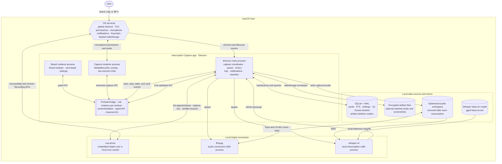

# Interruption Capture

Interruption Capture is a local-first macOS tray app for recording an incoming request without losing the work context you were in. A global shortcut captures the current CUA window reference before opening the microphone, transcribes speech locally with Whisper, and creates a persistent card on a five-column Kanban board.

## Team

- [@tobalo](https://github.com/tobalo) / [@tobalotv](https://x.com/tobalotv)
- [@iangreenberg1](https://x.com/iangreenberg1)
- [@zbangk](https://x.com/zbangk)

## Prompt

> Build a tool for a manager who is constantly interrupted during focused work. Let them capture an interruption in one sentence, classify urgency, schedule a revisit, and return to the original task with context intact.

## What works

- Five-column Kanban board: Captured, Today, Scheduled, Waiting, and Done.
- Primary **Capture** action with the configured shortcut shown on the button.
- Global capture shortcut (default: `Command+Shift+I`, shown as `⌘⇧I`).
- Local microphone recording and `whisper.cpp` transcription.
- Deterministic task, requester, urgency, revisit time, tags, and resume-note parsing.
- Default-on rolling 10-minute CUA context timeline, sampled every 30 seconds.
- Point-in-time card links to the exact app/window and timestamp range captured before the interruption.
- Exact-window resume when the original process/window identity can be verified.
- Local SQLite persistence with FTS search, ordering, archive recovery, notifications, snooze, and reschedule.
- Encrypted retained audio/screenshots, retention cleanup, and crash-safe deletion retries.
- Two-second Undo for newly captured cards and confirmed archive/delete flows.

## Demo

- Live demo: Local macOS app
- Video or screen recording: Not published
- Screenshots: Not published

## Requirements

- macOS on Apple silicon or Intel.
- Node.js 24 or newer and npm.
- `whisper-cli` and `ffmpeg` available locally. With Homebrew:

  ```sh
  brew install whisper-cpp ffmpeg
  ```

- Accessibility, Screen Recording, and Microphone permissions when prompted.

## Run locally

The prototype source remains in the team's private repository and is not included in this public submission. Team members can run the local checkout with:

```sh
npm ci
npm run setup
npm run dev
```

`npm run setup` downloads the pinned Whisper model and matching CUA driver binary, verifies their checksums, and stores them under `resources/`. Those large generated files are ignored by Git.

If the window was previously closed, click the tray icon and choose **Open board**. The app intentionally remains active in the tray so the global shortcut and rolling context sampler keep working.

## Privacy model

Rolling context capture stores only the app/window identity, window title-derived cue, and timestamps needed to reconstruct the preceding 10-minute context. It does not enable CUA action trajectory recording, persist accessibility trees, or persist rolling screenshots. Explicit interruption capture may retain an encrypted screenshot or audio only when the corresponding setting is enabled.

The rolling sampler is enabled by default and can be disabled in Settings. Disabling it purges all unlinked rolling samples while preserving timestamp ranges already linked to cards. **Delete all local data** cancels active capture, stops the sampler, securely clears SQLite records and WAL residue, drains encrypted artifact deletions, and leaves rolling capture off until it is explicitly enabled again.

Retained binary artifacts use Electron `safeStorage` encryption. Task metadata and transcripts remain local in SQLite; the database uses secure deletion and WAL checkpointing, but this build does not bundle SQLCipher. Use macOS FileVault when full at-rest volume encryption is required.

## Verification

```sh
npm run typecheck
npm run lint
npm test
npm run build
```

To create an unsigned local `.app` bundle with the CUA driver and Whisper model:

```sh
npm run package
```

Signing and notarization require the distributor's Apple Developer credentials and are intentionally not performed by the local build.

## Embedded runtime architecture

Everything runs locally on one Mac. Rectangles are OS processes or application surfaces, the double-bordered node is the per-window trust bridge, and cylinders are local data sources or stores.



At runtime:

1. The main-process timer asks `cua-driver` only for the foreground app/window identity every 30 seconds and keeps an unlinked 10-minute timeline in SQLite.
2. `⌘⇧I` resolves the exact app/window before the capture renderer requests microphone audio. The main process runs `ffmpeg`, then `whisper-cli`, parses the transcript into intent/task fields, and commits the card plus its timestamp range atomically.
3. Resume re-validates the saved process, bundle, and window IDs through `cua-driver`; it foregrounds only an exact, confirmed match.
4. SQLite owns task metadata and deletion retries. Optional retained media is written separately as Keychain-backed `safeStorage` envelopes; transient transcription audio is always removed.

The packaged binary uses the embedded `cua-driver` helper when macOS permissions are available and connects over its local Unix socket. If that helper is unavailable, the CUA SDK can use its same-process fallback inside Electron main. No product data or transcription is sent to a cloud service.

Code map:

- `src/main`: Electron lifecycle, IPC policy, SQLite, CUA, Whisper, tray, shortcuts, and notifications.
- `src/preload`: narrow context-isolated renderer bridge.
- `src/renderer`: React 19 board and separate capture-overlay surfaces.
- `src/shared`: strict TypeScript/Zod contracts and dependency-free IPC channel constants.
- `scripts`: checksum-verified local model and CUA driver setup.

The project uses TypeScript 7 in strict mode and pins exact dependency versions for reproducible installs.

## Tools and services

- Electron, React, TypeScript, Tailwind CSS, and shadcn/ui
- CUA for macOS app/window context and exact-window resume
- whisper.cpp and FFmpeg for local speech transcription
- SQLite for local persistence and full-text search
- Zod and context-isolated Electron IPC for runtime boundaries
- Vitest, Testing Library, and Oxlint for verification
- OpenAI Codex for implementation support

## Current status

- [ ] Concept only
- [ ] Mockup or walkthrough
- [ ] Partial prototype
- [x] Working prototype
- [ ] Ready for someone else to try

## Known limitations

- The prototype is macOS-only.
- Capture and exact-window resume require Microphone, Accessibility, and Screen Recording permissions.
- Local transcription requires Whisper and FFmpeg helper binaries and model files.
- The app is not signed or notarized, and no public binary is available yet.
- Request parsing is deterministic and intentionally narrower than a general natural-language task assistant.

## What we would build next

- Add a polished first-run setup for permissions and local model installation.
- Sign and notarize a distributable macOS build.
- Improve request parsing and recovery when an original window has closed or changed.
- Publish a short demo recording and screenshots.

## Public sharing

This repository is public. Only submit code, screenshots, recordings, data, and links that your team is comfortable sharing publicly.

- [x] This project is safe to share publicly as submitted.
- [x] We removed or replaced secrets, private data, and material we do not have permission to publish.
- [x] We understand that this repository and its project folders may be viewed, copied, or shared by others.
